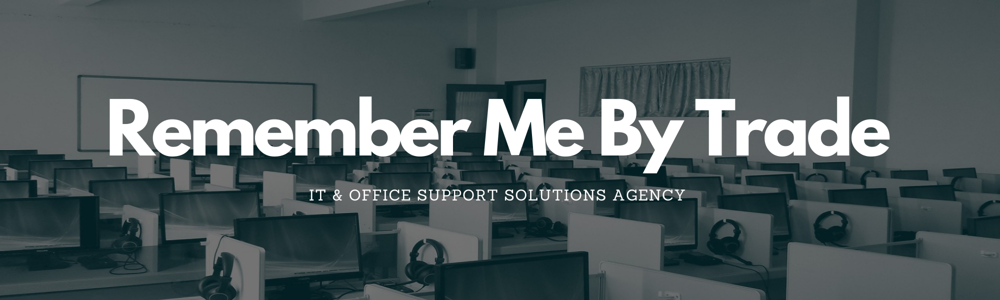
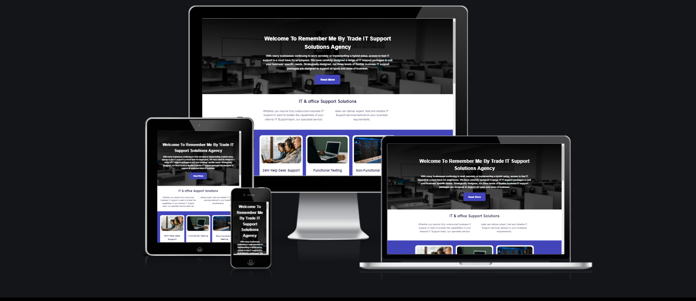

# Remember Me By Trade IT & Office Support Solutions Agency
This website was styled for an IT & Office support solutions agency, Based in London England. The aim of this is to give as much information about the site owner as possible - Remember Me By Trade, their experience and the services the company provides. The website is also designed to showcase company location. It is also aimed at any cpmpany who is looking for a IT specialist to provide support services for a company. Users of the site will be able to gain services, about us & contact information as well as are social media links to get intouch.

From the perspective of the site owner, the aim of this website is to generate customer interaction which will generate revenue by providing information about services, showcasing skills through the company's experience in the field and encouraging potential clients to get in touch.



Link to deployed site:

[Remember Me By Trade IT & Ofice Support Solutions Agency ](https://aol83.github.io/Remember-Me-By-Trade/)


## Strategy
----

### User Stories

This site's srategy is based on satisfying the below user scenario's:-

* As the user I need to be able to navigate around the website intuitively.

* Being the website's user, I want to find out insightful information about the company's background, their training and experience, Services and location.

* As a user of the website I want to be able to view infomation about the copmanys work ethics and reputation.


* As a user of the website I want access to contact information and be able to submit a request for a callback from the Company to show I am interested in their services.


## Structure
----

The site will consist of a Home landing page with navigationbar and five sections,those sections consist of information on skills, service's and work history reputation with a contact form; with a thank you page which will only shows when the contact form has been completed and submitted:-

<details>
<summary>Desktop Wireframes</summary>
<br>


</details>

<details>
<summary>Mobile Wireframes</summary>
<br> 


</details>


## Design
----

The site's owner wanted a modern 2022 style website. They decided on an eight color scheme incorporating a pastel tone colour pallete from [ColorSpace](https://mycolor.space/), we checked the colour pallete using [EigthShapes Contrast Grid](https://contrast-grid.eightshapes.com/?version=1.1.0&background-colors=&foreground-colors=%23FFFFFF%2C%20White%0D%0A%23F2F2F2%0D%0A%23DDDDDD%0D%0A%23CCCCCC%0D%0A%23888888%0D%0A%23404040%2C%20Charcoal%0D%0A%23000000%2C%20Black%0D%0A%232F78C5%2C%20Effective%20on%20Extremes%0D%0A%230F60B6%2C%20Effective%20on%20Lights%0D%0A%23398EEA%2C%20Ineffective%0D%0A&es-color-form__tile-size=compact&es-color-form__show-contrast=aaa&es-color-form__show-contrast=aa&es-color-form__show-contrast=aa18&es-color-form__show-contrast=dnp) So i decided to go with a simple design as thy chose an eight colour palette scheme of a off-whit, a shade of gray (used only on styling the navbar and footer) and these were used in contrast with an light blue for the hover state. A dark blue colour and off-white combination fot the buttons statics state gives the buttons highest rating in compliance with [WCAG 2.0 minimum contrast](https://www.w3.org/TR/UNDERSTANDING-WCAG20/visual-audio-contrast-contrast.html) for text/background.  


All the images used on site have been sourced from Pexels https://www.pexels.com/  and are copyright free images so permission was not needed. 

Google Fonts was used to select a modern and stylish looking font for the this websit.

## Features 
----

### Existing Features

* Logo
    - Clickable logo which allows the user to easily navigate back to the home page. This is a simple text design incorporating the name of the website.


* Navigation Menu 
    - This features on all pages of the website.  The position and style is consistent across all pages to allow the user to intuitively navigate each section of the mainlanding page as well as intuitively navigate to the other pages of the website.  The navigation menu also has an active class applied so the user can easily see which page they are currently on as the associated link will be marked with a neat bottom border.


* Footer 
    - Social Media Links to Facebook and Instagram and twitter to allow the user to stay connected to the company and see regular posts.
    - Telephone number and email address in footer on every page.  This means that the user does not have to navigate to a different page to have access to this information if they decide they want to email or telephone. 

   
  

* Home Page Features
    -The hero-image on landing page is quite eye catching with the contrast between the bright colours natural tones become  very striking. but leaves out enough information to entice the site user to make an enquiry.
    - There is also a contact button within the navbar which links directly to the contact form page.  This acts as a call to action to encourage the site user to submit their details to arrange a callback.  The contact button has a hover effect applied so the button background changechanges when it is hovered over to draw attention to itself. The same effect is used on all buttons across the site.

   


* Home Page Features Continued...
    - The home page also consists of one landing page with an image a welcome message in the head, beneath that is an infomaiton section with a small brief then another section containing three further images and infomation about services. Then the first information box provides the site user with introduction about RMBT IT & Office suppsupport Solutions Agency, their training, experience, and work ethos. There is also a links at the bottom of the page that encourage the user to visit us on our socila networks.  
    - The second information box provides brief contact information.
    - The information boxes are styled with a darker colour so that text is aloud to stand out.
    - As a decorative feature for this section. These are displayed next to eath other on larger screens, but stacked on top of each other when on smaller screens, such as mobile phones. 


* Contact Form
    - Input fields to submit name, company name, phone, and email address.
    makeup.
    - Text area to add information for a message to RBMT.
    - Submit button - With background effect. This button currently links to a thank-you page where a thank you message will be displayed to let the user know their information has been submitted and we will be in contact in due course. 
    - Each field has a ```required``` attribute applied to ensure users input all fields before submiting, the contact form is responsive on desktop devices the contact content is shifted to the left of the form and on smaller devices the contact content is stacked. 


* Thank-you Page
    -Thank-you page will only appear when the contact form has been fully completed and submitted.  It will display a short message to thank the users for getting in contact and confirming the RMBT will be in contact in due course.


<br/>

* Custom 404 Page
    - I have created a custom 404 error page which will be displayed if any of the links break during future development of the site.  This page is consistent with the design of the main site and contains the same logo, navigation and footer.  There is also a link to the home page within the error message so site users are able to easily navigate back to the home page. 


### Features Left to Implement

* Create an events page which will show upcoming wedding fayres where potential clients can meet Pip Southgate face-to-face to ask questions.
* Create a customer reviews page. 
* Add a drop down menu to the 'home' link in the navigation menu to link to events page and customer reviews page.
* Create the back-end of the form once I have acquired the necessary skills to ensure it is fully functioning and the site owner is alerted when a potential client would like a callback. 


## Testing
----

I have regularly tested all aspects of the site functionality including all links, inputs and responsiveness through Dev Tools in Chrome for the following devices:-

* Galaxy S5
* Pixel 3
* Pixel 2 XL
* iPhone 5/SE
* iPhone 6/7/8
* iPhone 6/7/8 Plus
* iPhone X
* iPhone 11 Pro
* iPad
* iPad Pro
* Surface Due
* Galaxy Fold
* Nest Hub
* Nest Hub Max

I have also tested the site physically on the below devices:

* iPhone 13 pro
* iPhone 11 Pro
* Mac Book Pro 
* Dell Lattitude 5310 (Laptop)

I have also regularly tested the site using the following browsers:-

* Chrome
* Safari
* Firefox
* Edge


### Validator testing 

* CSS file has been run through W3C CSS Validator and no errors have been found.  Two warnings have been found although these related to imported stylesheets which are not checked by the validator.
* All HTML files have been passed through the W3C HTML Validator and no errors have been found. 

<details>


<summary>CSS (W3C Validator)</summary>

</details>

<br>

<details>


<summary>HTML (W3C Validator)</summary>

</details>

<br>

<details>


<summary>Lighthouse Testing</summary>

</details>

### Accessibility Testing

The full site has been passed through wave.webaim.org to check for accessibility and the full report can be found [here.](https://wave.webaim.org/report#/https://shellied.github.io/pip-southgate-mua/contact.html)


### Bugs
---

* One of the issues I had from the beginning of this project was getting the position of the overlay text in the right place.  For a while I couldn't understand why the overlay text would stay in the same position on the screen and not adjust itself responsively, relative to the hero-image.  After many hours of fiddling around with the CSS, I realised that I had not added the ```relative ``` property to the ```#hero-image``` ID and so the overlay text was positioning itself absolute in relation to the ```#hero-image-container``` and not the ```#hero-image``` itself.  

* The image gallery has been one of my biggest problems in this project.  I started off by using a column grid to create a masonry gallery - similar to that used in the Love Running Project on the [Code Institute's](https://codeinstitute.net/) Full Stack Web Development Course.  This worked fine and looked great, until I added a hover effect to the images to allow them to scale up once hovered over.  Overall the effect was quite nice, however I immediately noticed that three of the top images would cut off after scaling up - which didn't look good.  After a discussion with a fellow student, I changed the gallery to flex box which fixed this issue, but brought a much larger issue when it came to making the gallery responsive.  On smaller screen sizes, the images would break out of the container and off the screen, or would break off the screen when scaling up with the hover effect.  I rectified this by adding (what felt like a million) media queries to alter the height of the container and the width of the images, depending on the screen sizes they were viewed on.  I used the dev tools to check for numerous devices and am now happy with the results.  An issue I do see with the way this gallery has been created is that it will be difficult to add new images to the gallery in the future as all of the media queries will most likely need updating at the same time.  With the benefit of hindsight, I can see that a carousel style gallery using pure CSS could have probably worked better than what I have ended up with.  In future development of this site, I would like to create a more robust gallery that is easier to update and has a slicker finish to it.

### - Bugs to fix 

* Despite the buttons on the 'Price List' and 'Contact' pages having the exact same CSS applied to them, the styling would be applied differently when in the browser - one would have the  zoom effect applied but the other wouldn't and in the Safari browser, the buttons would have different a border radius.  I realised this was because the button on the pricelist page was set as an anchor tag and the the button on the contact page was an ```input type="submit"``` button and part of the form.  I fixed this issue by changing the button on the pricelist page to from:

 ``` <a href="contact.html class="enquire-button">Contact Me</a>``` 
 
 to 

```<form action="contact.html" method="GET" aria-label="Click to open contact page"> <input type="submit" value="Contact Me" class="enquire-button"> </form>``` 
                
reusing the class attribute attached to the submit button on the contact page so as not to repeat code.  This produced the desired effect and both buttons now look and work the same. 

Whilst this is not semantically perfect, for the purpose of this project and given the time constraints, this is a suitable workaround for the time-being.  This is a bug I would like to rectify in the future when I have further understanding of applying CSS to different elements to maintain consistency across site.

* The position on the contact page of the date and time input fields are not quite in the right place on my iPhone 11 using Safar and Chrome, although I have noted from others who have tested the website on Samsung devices that the position shows as it should.  I need to do further research into why this could be happening and find a solution, however given the time constraints of this project, this is not something I have yet managed to do.  Below are the screenshots of how the form should look (using Dev Tools in Chrome) and how it actually appears on my iPhone 11 using Safari.


## Deployment 
----
 This site was depoloyed to GitHub pages.  The steps taken to deploy the site are as follows:

 * In the GitHub respository, select the settings menu
 * Choose the pages tab on the left hand side menu
 * From the source section drop-down menu, select the 'Main' branch
 * Once the page has automatically refreshed, the link to the successfully deployed page will be displayed.

Live link found here:  [Pip Southgate MUA - Bespoke Bridal Makeup](https://shellied.github.io/pip-southgate-mua/)

## Credits
----

* I used very similar code for my home page, nav bar and footer as taught in the 'Love Running Walkthrough Project' on the [Code Institute's](https://codeinstitute.net/) Full Stack Web Development course.  I did change some styling, but ultimately I was aiming for a simliar layout for my main page and navigation links/footer and as this was my first project this code helped me to get off to a good start.

* [CSS-Tricks](https://css-tricks.com/) has been an invaluable resource and I have read many articles relating to positioning, flexbox, and styling my contact form.

* [W3 Schools](https://www.w3schools.com/) - Again a valuable resource for consolidating what I had already learned and finding out more about HTML and CSS properties.

* [ColorSpace](https://mycolor.space/) - I used this website to select a color pallete, I started with a natural dark brown similar to that of the wood in the banner image and used that to generate a pallette of complementing colors.  From a selection of palettes generated, I chose the 'Classy Palette' - although as set out at the beginning of this document, this colorscheme was scrapped during the build process for something cleaner and slicker looking.

* [StackOverflow](https://stackoverflow.com/) - generally a good resource for finding answers to problems I was having that other coders had similar experiences of.

* [Google](http://google.com) - need I say more?!

* [Online Convert](https://image.online-convert.com/convert-to-webp) - used to convert images from jpeg to webp for better performance.

* [Tinypng](https://tinypng.com/) used to compress images for better performance.

* Pip Southgate - for providing all images and content for the website (permissions receieved from any wedding photographers and former-clients to use images).

## Technologies Used
----
* HTML
* CSS

## Frameworks and Libraries

* FontAwesome
* Google Fonts
* GitHub
* GitPod
* GitPages
* Am I Responsive
* Dev Tools

### Acknowledgments

* Huge thank you to Matt Bodden who invested a lot of time helping me understand a few of the (glaringly obvious) issues I was having with styling my buttons, gallery and generally just being a great support when I needed help.
* The brilliant Slack community for their encouragement, motivation and assistance.
* My mentor Brian O'Hare for his feedback and support.
* My husband, for bringing me plenty of tea, coffee and cake to keep me going :)

