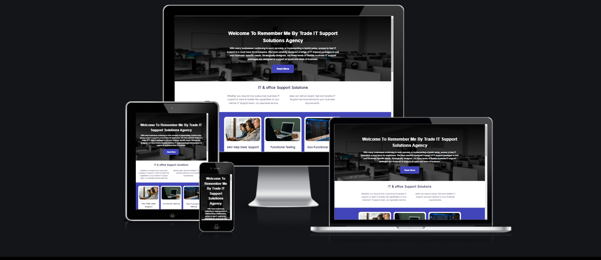
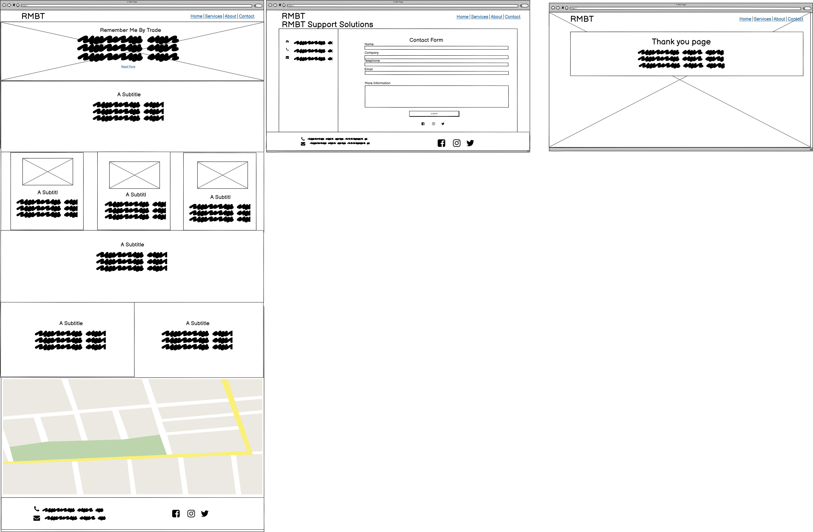
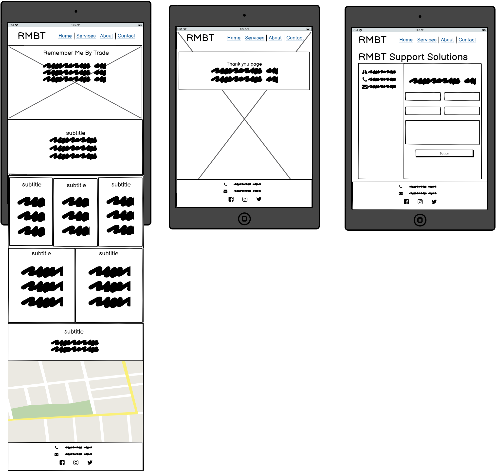
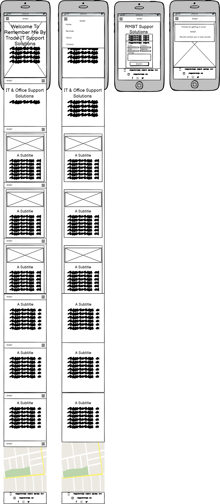

# Remember Me By Trade IT & Office Support Solutions Agency
This website was styled for an IT & Office support solutions agency, Based in London England. The aim of this is to give as much information about the site owner as possible - Remember Me By Trade, their experience and the services the company provides. The website is also designed to showcase company location. It is also aimed at any cpmpany who is looking for a IT specialist to provide support services for a company. Users of the site will be able to gain services, about us & contact information as well as are social media links to get intouch.

From the perspective of the site owner, the aim of this website is to generate customer interaction which will generate revenue by providing information about services, showcasing skills through the company's experience in the field and encouraging potential clients to get in touch.



Link to deployed site:

[Remember Me By Trade IT & Ofice Support Solutions Agency](https://aol83.github.io/Remember-Me-By-Trade/)


## Strategy
----

### User Stories

This site's srategy is based on satisfying the below user scenario's:-

* As the user I need to be able to navigate around the website intuitively.

* Being the website's user, I want to find out insightful information about the company's background, their training and experience, Services and location.

* As a user of the website I want to be able to view infomation about the copmanys work ethics and reputation.


* As a user of the website I want access to contact information and be able to submit a request for a callback from the Company to show I am interested in their services.


## Structure
----

The site will consist of a Home landing page with navigationbar and five sections,those sections consist of information on skills, service's and work history reputation with a contact form; with a thank you page which will only shows when the contact form has been completed and submitted:-

<details>
<summary>Desktop Wireframes</summary>
<br>




</details>

<br>

<details>
<summary>Mobile Wireframes</summary>
<br> 


</details>

<br>

## Design
----

The site's owner wanted a modern 2022 style website. They decided on a six color scheme incorporating a pastel tone colour pallete from [ColorSpace](https://mycolor.space/), we checked the colour pallete using [EigthShapes Contrast Grid](https://contrast-grid.eightshapes.com/?version=1.1.0&background-colors=&foreground-colors=%23FFFFFF%2C%20White%0D%0A%23F2F2F2%0D%0A%23DDDDDD%0D%0A%23CCCCCC%0D%0A%23888888%0D%0A%23404040%2C%20Charcoal%0D%0A%23000000%2C%20Black%0D%0A%232F78C5%2C%20Effective%20on%20Extremes%0D%0A%230F60B6%2C%20Effective%20on%20Lights%0D%0A%23398EEA%2C%20Ineffective%0D%0A&es-color-form__tile-size=compact&es-color-form__show-contrast=aaa&es-color-form__show-contrast=aa&es-color-form__show-contrast=aa18&es-color-form__show-contrast=dn) So i decided to go with a simple design as thy chose an eight colour palette scheme of a off-whit, a shade of gray (used only on styling the navbar and footer) and these were used in contrast with an light blue for the hover state. A dark blue colour and off-white combination fot the buttons statics state gives the buttons highest rating in compliance with [WCAG 2.0 minimum contrast](https://www.w3.org/TR/UNDERSTANDING-WCAG20/visual-audio-contrast-contrast.html) for text/background.  


All the images used on site have been sourced from Pexels https://www.pexels.com/  and are copyright free images so permission was not needed. 

Google Fonts was used to select a modern and stylish looking font for the this websit.

## Features 
----

### Existing Features

* Logo
    - Clickable logo which allows the user to easily navigate back to the home page. This is a simple text design incorporating the name of the website.


* Navigation Menu 
    - This features on all pages of the website. The position and style is consistent across all pages to allow the user to intuitively navigate each section of the mainlanding page and its content as well as intuitively navigate to the other pages of the website like the contact form.  The navigation menu has been styled with html and css only on large screens the nav will display the page links and the logo inline at the top of the page and on small devices the nav will change in to a working hambeurger drop down menue that is still usable without JavaScript when hoverd over links will change colour with a indicator line letting you know that the is usable.


* Footer 
    - Social Media Links to Facebook, Instagram and twitter with active transitions in color allow the user to know the link is active so they can stay connected to the companys activities and see regular posts.
    - Telephone number and email address in footer on every page.  This means that the user does not have to navigate to a different page to have access to this information if they decide they want to email or telephone. 

   
  

* Home Page Features
    -The hero-image on landing page is quite eye catching with the contrast between the bright colours natural tones it become very striking. but leaves out enough information to entice the site user to make an enquiry.
    - There is also a contact button within the navbar which links directly to the contact form page.  This acts as a call to action to encourage the site user to submit their details to arrange a callback.  The contact button has a hover effect applied so the button background changechanges when it is hovered over to draw attention to itself. The same effect is used on all buttons across the site.

   


* Home Page Features Continued...
    - The home page consists of the following one landing page with an image a welcome message in the head, beneath that is an infomaiton section with a small brief then another section containing three further images and infomation about services. Then the first information box provides the site user with introduction about RMBT IT & Office suppsupport Solutions Agency, their training, experience, and work ethos. There is also a links at the bottom of the page that encourage the user to visit us on our socila networks.  
    - The second information box provides brief contact information.
    - The information boxes are styled with a darker colour so that text is aloud to stand out.
    - As a decorative feature for this section. These are displayed next to eath other on larger screens, but stacked on top of each other when on smaller screens, such as mobile phones. 


* Contact Form
    - Input fields to submit name, company name, phone, and email address.
    - Text area to add information for a message to RBMT.
    - Submit button - With background effect. This button currently links to a thank-you page where a thank you message will be displayed to let the user know their information has been submitted and we will be in contact in due course. 
    - Each field has a ```required``` attribute applied to ensure users input all fields before submiting, the contact form is responsive on desktop devices the contact content is shifted to the left of the form and on smaller devices the contact content is stacked. 


* Thank-you Page
    -Thank-you page will only appear when the contact form has been fully completed and submitted.  It will display a short message to thank the users for getting in contact and confirming the RMBT will be in contact in due course.


<br/>


### Features Left to Implement

* ---------1.
* ----------2. 
* -----------3.
* ------------4. 


## Testing
----

I have regularly tested all aspects of the site functionality including all links, inputs and responsiveness through Dev Tools in Chrome for the following devices:-

* Galaxy S5
* iPhone 5/SE
* iPhone 6/7/8
* iPhone 6/7/8 Plus
* iPhone X
* iPhone 11 Pro
* iPad
* iPad Pro
* Surface Due


I have also tested the site physically on the below devices:

* iPhone 13 pro
* iPhone 11 Pro
* Mac Book Pro 
* HP (Laptop)

I have also regularly tested the site using the following browsers:-

* Chrome
* Safari
* Firefox
* Edge
* Brave


### Validator testing 

* CSS file has been run through W3C CSS Validator and no errors have been found.  Two warnings have been found although these related to imported stylesheets which are not checked by the validator.
* All HTML files have been passed through the W3C HTML Validator and no errors have been found. 


