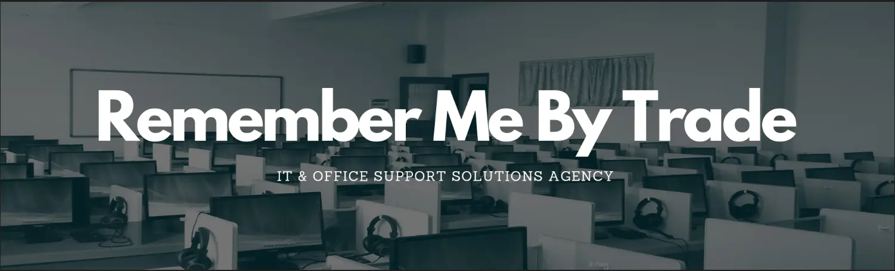
# Remember Me By Trade IT & Office Support Solutions Agency
This website is aimed mainly at Companys that have IT issues or need a position permanently or temporarily filled with a skilled member of staff based in London, the South of England. The aim is to give enough information about the site's owner - their experience and the services provided. Users of the site will be able to gain contact information, location and also submit a request for RMBT to contact them back.

From the perspective of the site owner, the aim of this website is to generate customer interaction which will generate revenue by providing information about services, showcasing skills through the company's experience in the field and encouraging potential clients to get in touch.

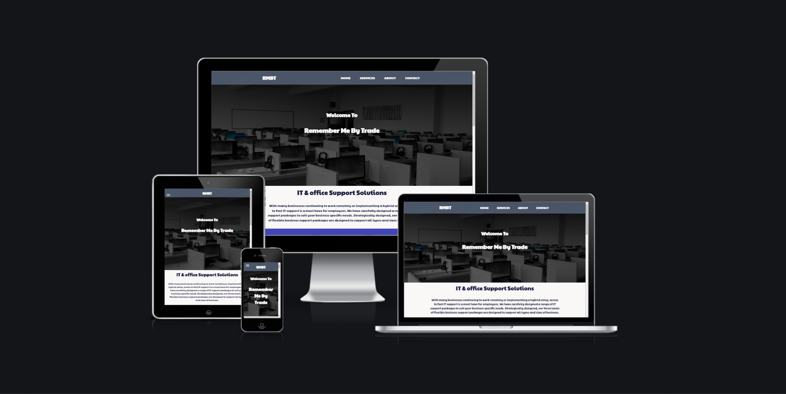

Link to deployed site:

[Remember Me By Trade IT & Ofice Support Solutions Agency](https://aol83.github.io/Remember-Me-By-Trade/)


## Strategy
----

## User Experience (UX)

-   ### User stories

    -   #### First Time Visitor Goals

        1. As a First Time User of the site, I want to easily understand the main purpose of the site and learn more about the organisations reputation.
        2. As a First Time User, I want to be able to easily navigate throughout the site to find content.
        3. As a First Time User, I want to locate a contact form so I can ask about services or request a call back. 

    -   #### Returning Visitor Goals

        1. As a Returning User, I want to find information about any new service's.
        2. As a Returning User, I want to find the best way to get in contact with the organisation with any questions I may have.
        3. As a Returning User, I want to find their social media links to see their followers on social media to determine how known they are.


## Structure
----

The site will consist of a Home landing page with a navigation bar and five sections, those sections consist of information on skills, services, and work history reputation with a contact form; with a thank you page which will only show when the contact form has been completed and submitted:-

<details>
<summary>Desktop Wireframes</summary>
<br>

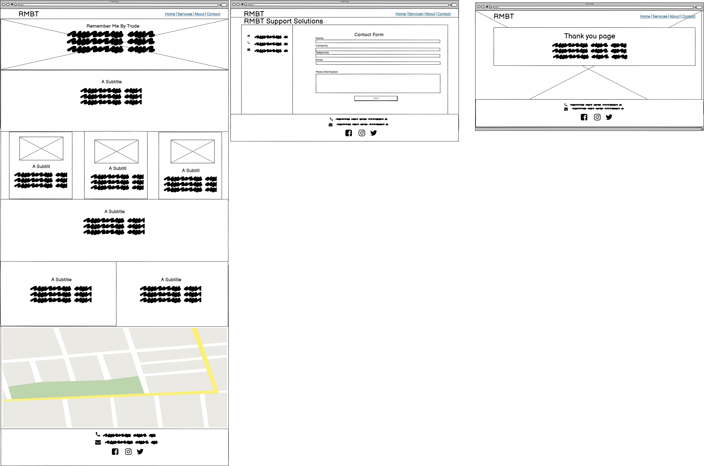


</details>

<br>

<details>
<summary>Mobile Wireframes</summary>
<br> 

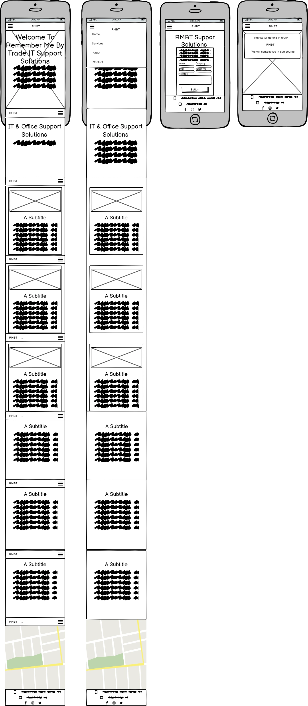
</details>

<br>

## Design
----

The site's owner wanted a modern 2022-style website. They decided on a five-color scheme incorporating a pastel tone colour pallet from [ColorSpace](https://mycolor.space/), we checked the colour pallet using [EigthShapes Contrast Grid](https://contrast-grid.eightshapes.com/?version=1.1.0&background-colors=&foreground-colors=%23faf8f6%2C%0D%0A%2300a4fcd9%0D%0A%234244b9%0D%0A%23191641%0D%0A%23536075de&es-color-form__tile-size=compact&es-color-form__show-contrast=aaa&es-color-form__show-contrast=aa&es-color-form__show-contrast=aa18&es-color-form__show-contrast=dnp), I decided to go with a simple design as they had chosen a five colour palette scheme of an off-white, a shade of gray (used only on styling the navbar) these were used in contrast with a light blue for the hover state of the buttons. The dark blue colour and off-white combination for the button's statics state this gives the buttons the highest rating in compliance with [WCAG 2.0 minimum contrast](https://www.w3.org/TR/UNDERSTANDING-WCAG20/visual-audio-contrast-contrast.html) for text/background.

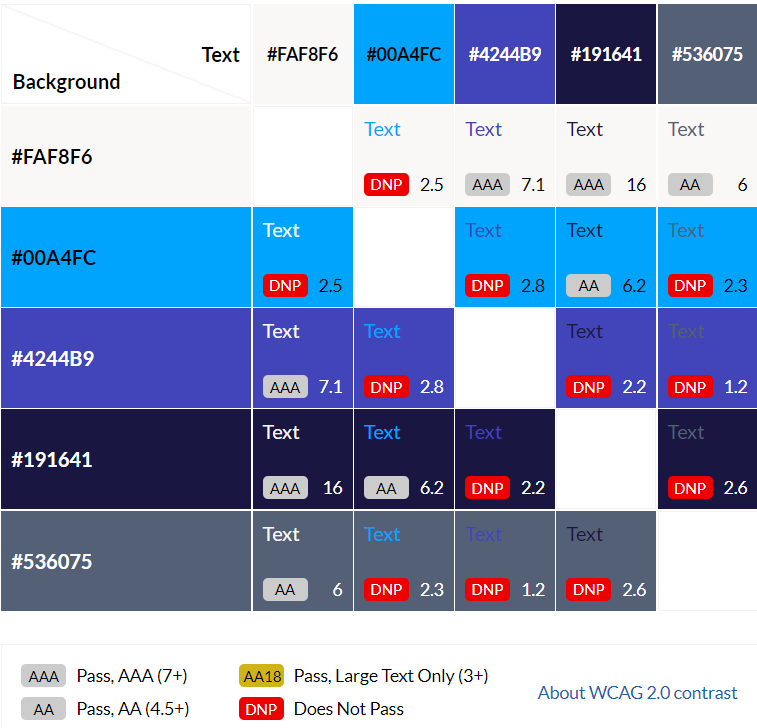

All the images used on this website have been sourced from Pexels https://www.pexels.com/  who do not require attribution or compensation to the content creator as part of the licencing conditions (https://www.pexels.com/terms-of-service/. 

Google Fonts was used to select a modern and stylish looking font for this website.

## Features 
----

### Existing Features


* Navigation Menu 
    - This features on all pages of this website. The style is consistent across all pages to allow the user to intuitively navigate each section of the main landing page, and its content as well as intuitively navigate to other pages like the contact form.  The navigation menu has been styled with html and css only, on large screens the nav will display the page links and the logo inline at the top of the page and on small devices the nav will change in to a hambeurger drop down menu that is still usable, when hoverd over the links will change colour with a indicator line letting you know that the button is actionable.
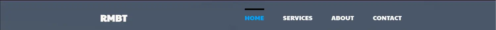

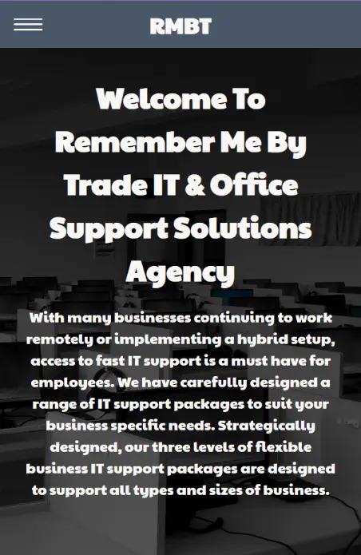

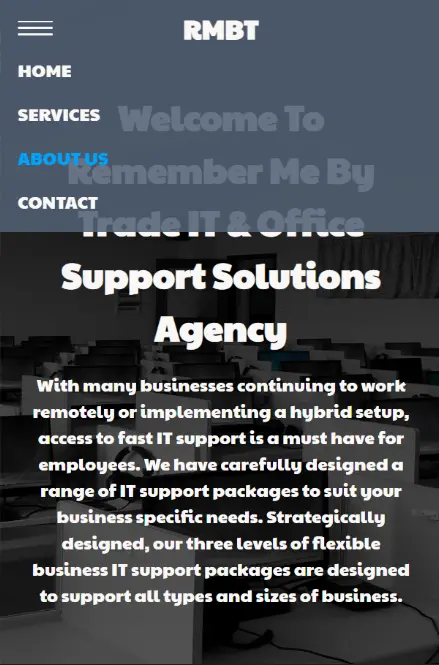

* Footer 
    - Social network Links to Facebook, Instagram and twitter, that have a active transitions in color that allows the user to know the links are active, so they can stay connected to the companys activities and see regular posts.
    - Telephone number and email address in footer on every page. This means that the user does not have to navigate to a different page to have access to this information if they decide they want to email or telephone. 

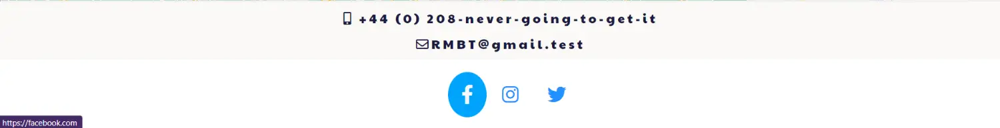
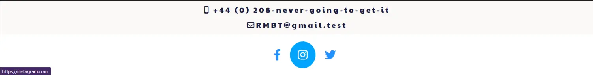   
  

* Home Page Features
    - The hero-image that is on the main landing page seems to be very eye catching with the contrast between the bright colours natural tones it becomes very striking. the about section leaves out enough information to entice the site user to make an enquiry.
    - There is also a contact button within the navbar which links directly to the contact form page.  This acts as a call to action to encourage the site user to submit their details to arrange a callback.  The contact button has a hover effect applied so the buttons background changes when it is hovered over to draw attention to itself. The same effect is used on all buttons across the site.

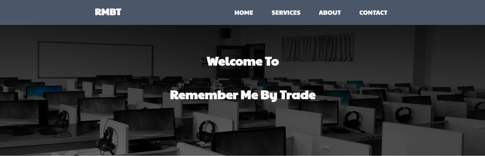
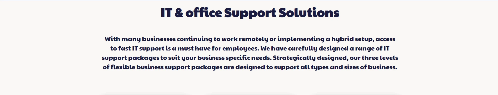
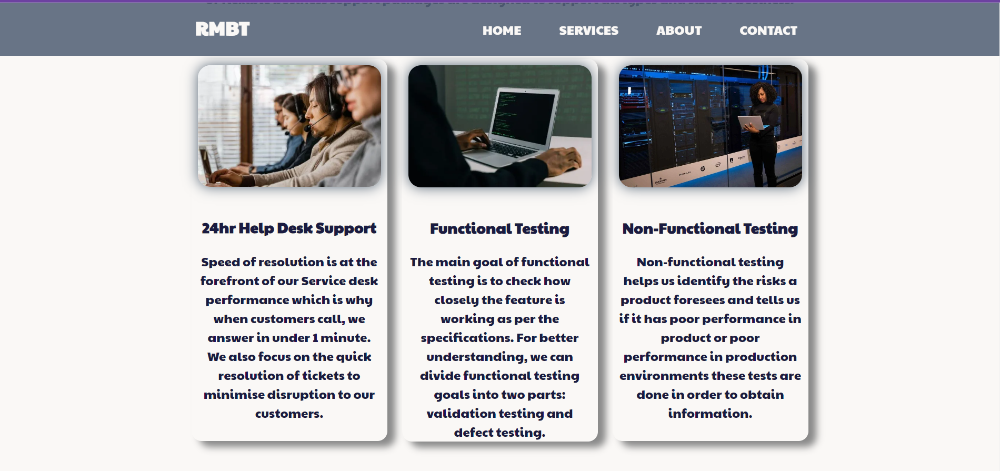
   


* Home Page Features Continued...
    - The home page consists of the following. One landing page with an image and welcome message located in the head, beneath that is an information section with a small brief, then another section containing three images and information about services. Then the first information box provides the site user with an introduction section about RMBT IT & Office Support Solutions Agency training, experience, and work ethos. There is also links at the bottom of the page that encourage the user to visit us on our social networks.  
    - The second information box provides brief contact information.
    - The information boxes are styled with a darker colour so that text is allowed to stand out.
    - As a decorative feature for this section. These are displayed next to each other on larger screens, but stacked on top of each other when on smaller screens, like mobile phones.
     - The iframe map feature is to show the companys location I felt adding this was important. 


* Contact Form
    - Input fields to submit name, company name, phone, and email address.
    - Text area to add information for a message to RBMT.
    - Submit button - With background effect. This button currently links to a thank-you page where a thank you message that will be displayed to let the user know their information has been submitted and RMBT will be in contact in due course. 
    - Each field has a ```required``` attribute applied to ensure users input all fields before submitting.The contact form is responsive on desktop devices and on smaller devices the contact content is stacked. 


* Thank-you Page
    -Thank-you page will only appear when the contact form has been fully completed and submitted.  It will display a short message to thank the users for getting in contact and confirming that RMBT will be in contact in due course.


<br/>


### Testing User Stories from User Experience (UX) Section

-   #### First Time Visitor Goals

    1. As a First Time Visitor, I want to easily understand the main purpose of the site and learn more about the organisation.

        1. Upon entering the site, users are automatically greeted with a clean and easily readable navigation bar to go to the page of their choice. Underneath there is a Hero Image with Text.
        2. The main points are made immediately with the hero image
        3. The user has two options, click the call to action buttons in the nav or scroll down, both of which will lead to the same place, to learn more about the organisation.

    2. As a First Time Visitor, I want to be able to easily be able to navigate throughout the site to find content.

        1. The site has been designed to be fluid and never to entrap the user. At the top of each page there is a clean navigation bar, each link describes what page they will end up at clearly.
        2. At the bottom of every page there are social network links to be used as a call to action to ensure the user always has somewhere to go and doesn't feel trapped as they get to the bottom of the page.
        3. On the Contact Us Page, after a form is correctly submitted, you will be take to a thank you page to let you know you message has been received.

    3. As a First Time Visitor, I want to look at the company's skills and hear what clients think of them and see if they are trusted. I also want to locate their social media links to see their following on social media to determine how trusted and known they are.
        1. Once the new visitor has read the About Us and What We Do, they will notice We are trusted.
        2. The user can also scroll to the bottom of any page on the site to locate social media links in the footer.
        3. At the bottom of the Contact Us page, the user is told underneath the form, that alternatively they can contact the organisation on social media which highlights them hoverd over.

-   #### Returning Visitor Goals

    1. As a Returning Visitor, I want to easily find a contact form to get in touch if I have any questions or get in touch via social media and an map to show a companys location if i need to go the the office.

        1. This is clearly shown in the ifram map.
        2. social media links easily accessible on every page.

    2. As a Returning Visitor, I want to find the best way to get in contact with the organisation with any questions I may have.

        1. The navigation bar clearly highlights the "Contact Us" call to action link in the nav when hoverd over.
        2. Here they can fill out the form on the page to reach us.
        3. The footer contains links to the organisations Facebook, Twitter and Instagram page as well as the organization's email.
        4. Whichever link they click, it will be open up in a new tab to ensure the user can easily get back to the website.

    3. As a Returning Visitor, I want to find the Facebook Group link so that I can join and interact with others in the community.
        1. The Facebook Page can be found at the footer of every page and will open a new tab for the user and more information can be found on the Facebook page.
        2. Alternatively, the user can scroll to the bottom of the Home page to find the Facebook link.


## Testing
----

I have tested all aspects of the site functionality including all links, inputs and responsiveness  as best as possible through Dev Tools, Chrome & lighthouse for the following devices. (I would have liked a more extensive and in depth testing script but with the little time I had left my testing is as follows):-

### Further Testing

-   The Website was tested on Google Chrome, Internet Explorer, Microsoft Edge, Brave and Safari browsers.
-   The website was viewed on a variety of devices such as Desktop, Laptop, iPhone5c, iPhone 8 & iPhoneSmaX.
-   A large amount of testing was done to ensure that all pages were linking correctly.
-   Friends on slack and family members were asked to review the site to point out any bugs and/or user experience issues.

### Known Bugs

-   On some mobile devices the nav toggle button pushes towards the the bottm of the navigation bar.
-   On Microsoft Edge and Internet Explorer Browsers, the all pages have a slight bounce in the x&y axis.


I tested the sites style consistency on the below devices:

* iPhone 5/SE
* iPhone 6/7/8
* iPhone 6/7/8 Plus
* iPhone X
* iPhone 11 Pro
* iPad
* iPad Pro


I tested the site physically on the below devices:

* iPhone 13 pro
* iPhone 11 Pro
* Mac Book Pro 
* HP (Laptop)

I have also tested the site using the following browsers:-

* Chrome
* Safari
* Edge
* Brave


### Validator testing 

* CSS file has been run through W3C CSS Validator and no errors have been found.  Two warnings have been found although these related to imported stylesheets which are not checked by the validator.
* All HTML files have been passed through the W3C HTML Validator and no errors have been found. 

<details>


<summary>CSS (W3C Validator)</summary>

</details>

<br>

<details>

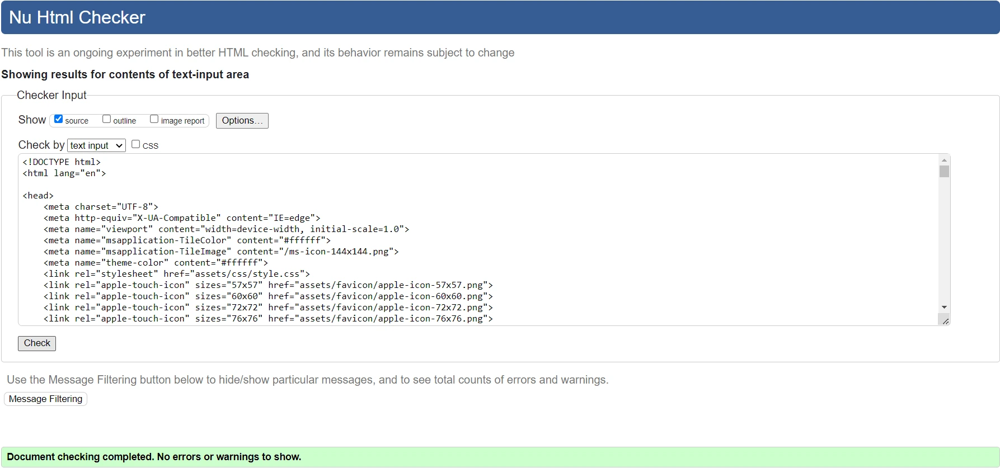
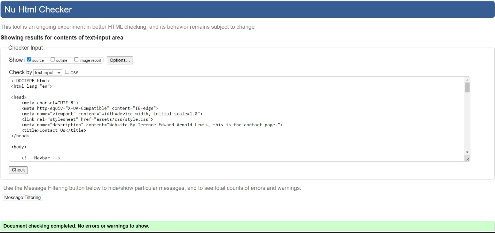
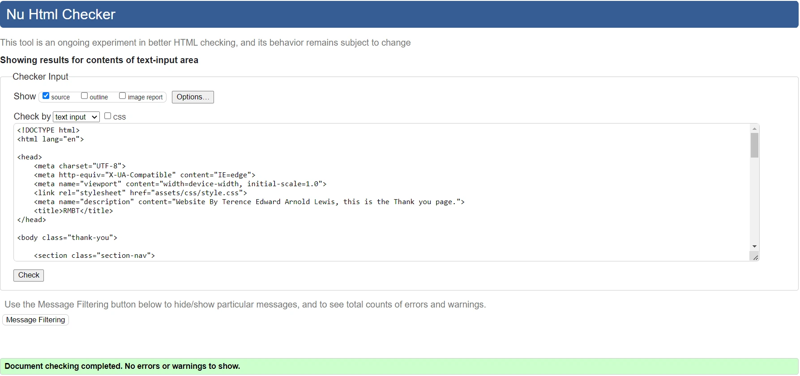


<summary>HTML (W3C Validator)</summary>

</details>

<br>

<details>


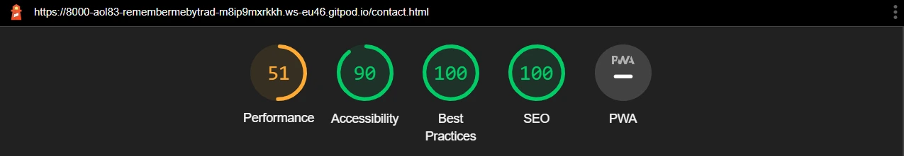
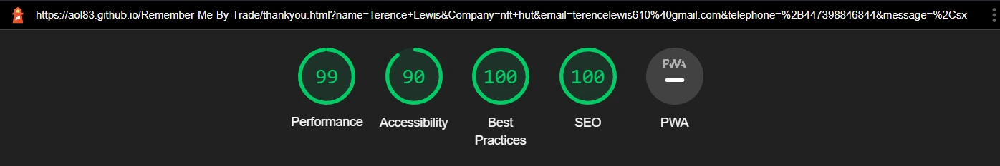

<summary>Lighthouse Testing</summary>

</details>

### Accessibility Testing

The full site has been passed through wave.webaim.org to check for accessibility the only error found was for a span that is necessary for my nav to work so error could not be resolved and the full report can be found  [here.](https://wave.webaim.org/report#/https://aol83.github.io/Remember-Me-By-Trade/)


### Bugs
---

* One of the issues I had from the beginning of this project was getting my nav to be responsive, and to change into a working hamburger drop down menu when on small devices, and a positioning inconsistency I found but after talking to fellow students and mentors adding a position of fixed and text align of center got it resolved.  

* The responsive contact form was the biggest issue I had on this project, because when I had originally put my contact form together, it was styled desktop first instead of mobile first, so i struggled to get my media queries to work, in the end I had to strip back, and start again with mobile first, and work up from there. Doing this resolved many styling issues I had encountered.


## Deployment 
----
 This site was deployed to GitHub pages.  The steps taken to deploy the site are as follows:

 * In the GitHub respository, select the settings menu
 * Choose the pages tab on the left hand side menu
 * From the source section drop-down menu, select the 'Main' branch
 * Once the page has automatically refreshed, the link to the successfully deployed page will be displayed.

Live link found here:  [RMBT SUPPORT SOLUTIONS](https://aol83.github.io/Remember-Me-By-Trade/)

## Credits
----

* I used similarly structured code for my home page, nav bar and footer as taught in the 'Love Running Walkthrough Project' on the [Code Institute's](https://codeinstitute.net/) Full Stack Web Development course and then made my changes from there as I wanted to add a bit of my own artistic flare to it using the sources of infomation I had been kindly give. I did change some of the styling, but ultimately I was aiming for a simliar layout for my main page and navigation link response and the footer. As this was my first project this code helped me to get off to a good start.

* [CSS-Tricks](https://css-tricks.com/) has been an invaluable resource and I have read many articles relating to positioning, flexbox, and styling my contact form.

* [W3 Schools](https://www.w3schools.com/) - Again a valuable resource for consolidating what I had already learned and finding out more about HTML and CSS properties.

* [ColorSpace](https://mycolor.space/) - I used this website to select a color pallete, I started with a natural dark purple similar to that and used that to generate a pallette of complementing colors.  From a selection of pastel palettes generated, I chose the 'Classy Palette'.

* [StackOverflow](https://stackoverflow.com/) - Good resource for finding answers to problems I was having that other coders had similar experiences of.

* [Google](http://google.com) - Grate source of infomation?!

* [Online Convert](https://image.online-convert.com/convert-to-webp) - used to convert images from jpeg to webp for better performance.

* [Tinypng](https://tinypng.com/) used to compress images for better performance.

* Thanks to Pexels - for providing all images.

## Technologies Used
----
* HTML
* CSS

## Frameworks and Libraries

* FontAwesome
* Google Fonts
* GitHub
* GitPod
* GitPages
* Am I Responsive
* Dev Tools

### Acknowledgments

* Firstly I would like to say, that this has been a brilliant, and unforgettable learning experience for me, as a person with multiple learning issues like dyslexia and others, I decided to take the chance at doing something I have found a massive love for, which has revived my thrust for learning so win, loose, or draw I can come away knowing I have learned key skills I definitely didn't know before.
I would like to take a minute to thank everyone that has been involved in my coding journey especially Scott Clarke
Education Adviser who help me after taking the five-day coding challenge and encourage me to take the leap, and I'm glad I did so a big thanks to him.
Also, I would like to thank the following people that have found the time to teach an old dog new tricks these people where very friendly, and made me feel right at home. 

* A massive thanks to the code institute for for the opportunity to take the corse and for the invaluable help with the structure of my website.
* Huge huge thanks to Shellie Downie who invested more than a lot of time helping me, and gave me loads of sources of information to help me under where I was going wrong the idea for my thank you page as well as helping me understand a few of the (Obvious) issues I was having as well, but generally being a great port of support when I needed the help so a BIG THANKS again to her.
* Thanks to Matt Bodden who took time to teach a brick wall like me. Thanks to his advice I was able to grasp a more rounded understanding of flexbox and the problems I had starting with desktop first. 
* My mentor Reuben Ferrante for his great feedback, support and input Big big thanks.
* My mentor Narender Singh who managed to help me understand areas of css and html i hand not fully understood.
* The brilliant Slack community for their encouragement, motivation and assistance.
* Maggie Jury who help me with feedback and testing big thanks.
* Liz Conway who also help with feedback and testing thank you.
* Kevin Powell for his help and tuition in understanding responcive hamburger navigation layouts big thanks to him.
* Traversy Media for his help and tuition in understanding responsive pages, and form stylings so a big thanks as well.